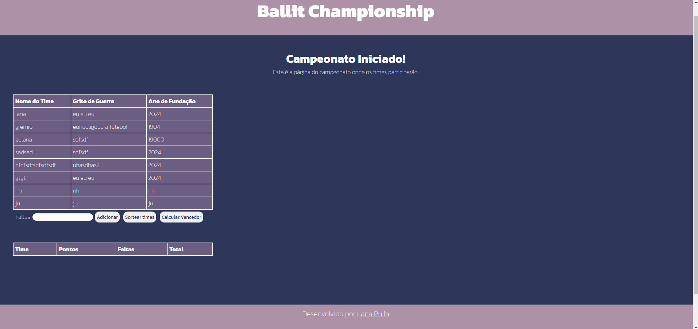

# Ballit Championship

Este projeto seria uma aplicação web em JavaScript, com as dependências React, Vite e Nodejs.

## Descrição

A principal funcionalidade é imprimir um formulário de cadastro, onde seus dados serão mostrados em uma tabela de organização. A tabela permite a exclusão dos dados, número máximo e número mínimo de linhas. Ao chamamento do início do Campeonato é verificado se há um número válido de times.  
Em sua segunda página, a tabela de times retorna para calcular qual time entre eles foi o vencedor, onde o formulário insera as faltas na tabela, com cada uma valendo 10 pontos negativos. Com isso, os times são sorteados para o cálculo aleatoriamente, onde só sobrará um para ser o vencedor. 

## Status
- Em andamento.

## Funcionalidades principais:

- Gerenciamento de times: Permite que os usuários adicionem novos times e seus dados à tabela;
- Exclusão de Times: Os usuários podem excluir a sua última inserção;
- Sotear times: Ápos o cadastro dos times, eles são sorteados aleatoriamente;
- Cadastro de faltas: o formumário insere as faltas na tabela;
- Calcular faltas: Com as na tabela é feita a conta de quantos pontos cada time obteve (começando com 50 pontos) baseada na quantidade de faltas (onde cada uma vale 10);
- Imprime o time vencedor: um cartão com o time vencedor é impresso na tela;
- Times excluídos: os times já sorteados e que perderam no cálculo de faltas são apagos da tabela;
- Sorteio: o time vencedor continua na tabela de pontos até que algum outro time o vença, ou que não sobre nenhum na tabela.

## Tecnologias 
- React;
- Vite;
- NodeJS.

## Interface Home

## Interface Table

## Interface campeonato 

## Avisos
Esse projeto não foi desenvolvido somente pela desenvolvedora Lana. A criação da aplicação contou com o suporte de diversas ferramentas, como cursos, a colaboração de outros desenvolvedores, IA e recursos disponíveis para conhecimento público.
