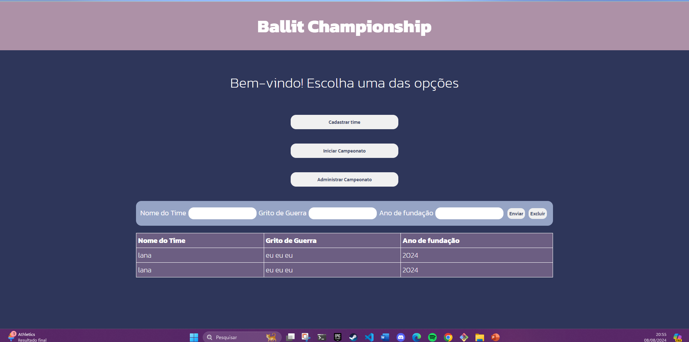

# Ballit Championship

Este projeto seria uma aplicação web em JavaScript, com as dependências React, Vite e Nodejs.

## Descrição

Atualmente sua principal funcionalidade é imprimir um formulário de cadastro, onde seus dados serão mostrados em uma tabela de organização. A tabela permite a exclusão dos dados, número máximo e número mínimo de linhas. Ao chamamento do início do Campeonato é verificado se há um número válido de times.  
Na aplicação, os botões no código ainda precisam ser implementados. O segundo botão vai iniciar o campeonato sorteando os times de forma aleatória, e durante a partida será exibido um painel de controle onde será possível registrar faltas e punições.

## Status
- Em andamento.

## Funcionalidades principais:

- Gerenciamento de times: Permite que os usuários adicionem novos times e seus dados à tabela;
- Exclusão de Times: Os usuários podem excluir a sua última inserção.

## Tecnologias 
- React;
- Vite;
- NodeJS (a ser implementado).

## Interface Home

## Interface Table
